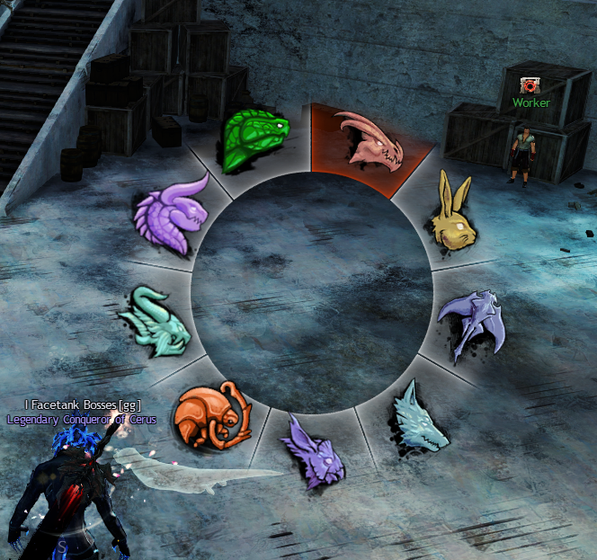

# GW2-RadialMenus
 A highly customisable radial menu addon.
 
## Installation
Install via the [Nexus](https://raidcore.gg/Nexus) Addon Library or download the latest `radials.dll` from the [Releases](https://github.com/RaidcoreGG/GW2-RadialMenus/releases) and place in `<Guild Wars 2>/addons`

## Examples
